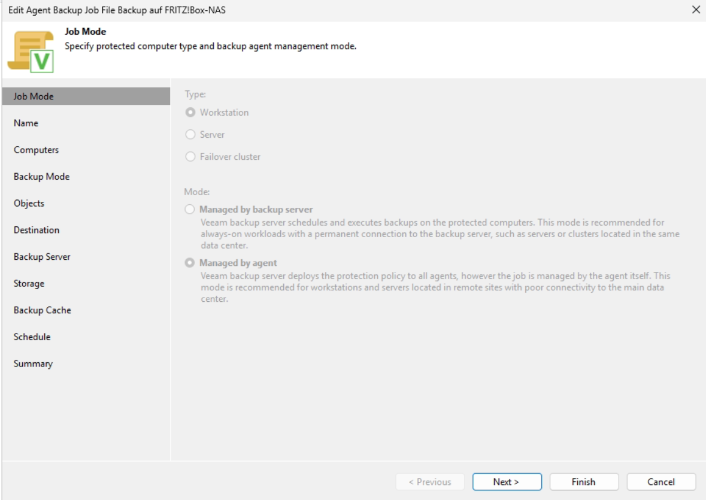

#  Veeam File Backup auf FRITZ!Box-NAS (USB-Stick)

> **Warum diese Lösung?**
> Nicht jede Datei braucht ein vollständiges System-Backup. Wenn es darum geht, einen **bestimmten Ordner** (z. B. Projektdaten, Dokumente, Datenbank-Exporte) regelmäßig zu sichern, ist ein gezieltes **File Level Backup** die effizienteste Wahl. Als Ziel dient hier ein USB-Stick, der direkt an der FRITZ!Box hängt und damit als einfaches Netzwerk-NAS fungiert — kostengünstig, immer verfügbar und ohne extra Hardware.

---

##  Voraussetzungen

- Veeam Backup & Replication installiert und lizenziert
- USB-Stick an der FRITZ!Box angeschlossen und als Netzwerkfreigabe (SMB) eingerichtet
- Repository **USB-NAS** bereits in Veeam angelegt
- Administratorrechte auf dem Backup-Server

---

##  Einrichtungsschritte

### Schritt 1 — Job-Modus festlegen

Den bestehenden Job öffnen oder einen neuen Job anlegen. Der **Job-Modus** bleibt auf den vorhandenen Einstellungen — Typ und Verwaltungsmodus sind bereits konfiguriert.

>  **Managed by agent** bleibt die richtige Wahl: Der Agent auf dem Gerät führt die Sicherung selbstständig durch, auch wenn die Verbindung zum Backup-Server kurzzeitig nicht besteht.

---

### Schritt 2 — Job benennen

Den Job eindeutig benennen: **`File Backup auf FRITZ!Box-NAS`**

>  **Warum ein eigener Job statt den bestehenden erweitern?**
> Ein separater Job für diesen Ordner ermöglicht eine **unabhängige Planung, eigene Aufbewahrungsregeln und separate Benachrichtigungen**. Wird der Ordner irgendwann nicht mehr gebraucht, lässt er sich einfach deaktivieren — ohne den Rest zu beeinflussen.

---

### Schritt 3 — Gerät und Anmeldedaten konfigurieren

Das zu sichernde Gerät (`10.10.10.97`) ist bereits in der Liste. Beim Hinzufügen weiterer Geräte: Hostname oder IP eingeben und passende Anmeldedaten (Username + Passwort) hinterlegen.

>  **Sicherheitshinweis:**
> Nur Konten mit den minimal notwendigen Rechten verwenden. Die Zugangsdaten werden verschlüsselt im Veeam Credentials Manager gespeichert.

---

### Schritt 4 — Backup-Modus: File Level Backup

Als Sicherungsmodus **File level backup (slower)** auswählen.

>  **Warum File Level und nicht Entire Computer?**
> Hier geht es nicht darum, das gesamte System wiederherstellen zu können — sondern darum, **einen bestimmten Ordner** (`C:\Dilo_NAS`) dauerhaft zu schützen. File Level Backup ist dabei deutlich schneller in der Einrichtung, benötigt weniger Speicherplatz und erlaubt eine gezielte Wiederherstellung einzelner Dateien ohne den Umweg über ein vollständiges System-Restore.

---

### Schritt 5 — Zu sichernden Ordner hinzufügen

Unter **Objects** → **The following file system objects** → **Add...** den Ordnerpfad eintragen: `Dilo_NAS` (entspricht `C:\Dilo_NAS` auf dem Gerät).

>  **Gezielt statt alles:**
> Nur der Ordner `C:\Dilo_NAS` wird gesichert — kein unnötiger Overhead durch Systemdateien, temporäre Dateien oder den gesamten Datenträger. Das hält die Backup-Größe klein und die Laufzeit kurz.

---

### Schritt 6 — Ordner bestätigt

Der Ordner `C:\Dilo_NAS` erscheint in der Objektliste und ist bereit für die Sicherung.

---

### Schritt 7 — Sicherungsziel festlegen

Als Ziel **Veeam backup repository** auswählen — das Repository zeigt auf den USB-Stick an der FRITZ!Box.

>  **Warum nicht „Shared folder" direkt?**
> Die Nutzung eines Veeam-Repositorys (statt direktem SMB-Pfad) ermöglicht zentrale Verwaltung, Deduplizierung, Komprimierung und Monitoring — selbst wenn das Ziel physisch ein einfacher USB-Stick ist. Veeam kümmert sich um das Dateiformat, die Konsistenz und die Aufbewahrungsregeln.

---

### Schritt 8 — Backup-Server angeben

Den DNS-Namen des Veeam Backup Servers eintragen: `W25-Test.Dilo.MH.local`

>  **Wichtig:** Dieser Name muss vom gesicherten Gerät aus auflösbar sein. Bei Geräten außerhalb des lokalen Netzwerks ggf. die externe IP-Adresse verwenden.

---

### Schritt 9 — Repository und Aufbewahrungsdauer

Repository **USB-NAS** auswählen (57,2 GB frei von 57,3 GB). Aufbewahrung auf **5 Tage** belassen.

>  **Aufbewahrung bei File Backups:**
> 5 Tage sind für einen einzelnen Ordner gut geeignet — es werden die letzten 5 Sicherungspunkte behalten. Da es sich um File Level handelt, sind die Sicherungen ohnehin deutlich kleiner als vollständige System-Backups, sodass der USB-Stick lange ausreicht.

>  Der Hinweis *„Periodic fulls are not enabled in Advanced settings"* erscheint, weil die GFS-Archivierungsoption deaktiviert ist — für diesen Use Case völlig ausreichend.

---

### Schritt 10 — Synthetische Vollsicherung (Advanced Settings)

Unter **Advanced → Backup**: **Synthetic full backup** ist aktiviert und läuft jeden **Samstag**.

>  **Warum auch bei File Backups eine wöchentliche Vollsicherung?**
> Täglich werden nur geänderte Dateien gesichert (inkrementell). Die wöchentliche synthetische Vollsicherung konsolidiert alle Änderungen zu einem konsistenten Wiederherstellungspunkt — direkt auf dem Server, ohne erneute Übertragung aller Daten. Das beschleunigt die Wiederherstellung erheblich.

---

### Schritt 11 — E-Mail-Benachrichtigungen

Unter **Advanced → Notifications**: Täglichen Bericht an `admin@xxxxxxx.de` aktiviert, täglich um 22:00 Uhr. Warnung, wenn 7 Tage kein Backup erstellt wurde.

>  **Warum Benachrichtigungen auch für kleine Jobs?**
> Gerade weil dieser Job „im Hintergrund" läuft und selten manuell geprüft wird, sind automatische Benachrichtigungen wichtig. Die 7-Tage-Warnung stellt sicher, dass ein ausgefallener Job nicht unbemerkt bleibt.

---

### Schritt 12 — Backup Cache (deaktiviert)

Der Backup Cache ist in diesem Job **nicht aktiviert**.

>  **Warum hier nicht nötig?**
> Das Ziel ist ein USB-Stick am lokalen FRITZ!Box-Router — dieser ist im Heimnetzwerk oder Büronetzwerk praktisch immer erreichbar. Ein lokaler Cache wäre nur sinnvoll, wenn das Gerät regelmäßig außerhalb des Netzwerks betrieben wird.

---

### Schritt 13 — Zeitplan konfigurieren

- **Täglich um 20:30 Uhr**, jeden Tag (Everyday)
- **Wenn Gerät ausgeschaltet**: Skip backup
- **Nach der Sicherung**: Keep running

>  **Warum 20:30 Uhr und „Skip backup" bei ausgeschaltetem Gerät?**
> Um 20:30 Uhr ist der Arbeitstag beendet, die Daten des Tages sind vollständig im Ordner `C:\Dilo_NAS`. „Skip backup" bei ausgeschaltetem Gerät ist hier bewusst gewählt — anders als bei Benutzer-Workstations soll der Server-Prozess nicht unnötig verzögert werden. Der nächste Tag bringt die nächste Sicherung.

---

### Ergebnis 

Der Job **File Backup auf FRITZ!Box-NAS** ist aktiv, Status **Enabled**, zuletzt ausgeführt vor 5 Minuten, Ziel: **USB-NAS**.

---

##  Zusammenfassung der Konfiguration

| Einstellung | Wert |
|-------------|------|
| Job-Name | File Backup auf FRITZ!Box-NAS |
| Job-Typ | Windows Agent Policy |
| Verwaltungsmodus | Managed by Agent |
| Sicherungsmodus | File Level Backup |
| Gesicherter Ordner | `C:\Dilo_NAS` |
| Ziel | Veeam Repository (USB-NAS) |
| Speicherort | USB-Stick an FRITZ!Box |
| Zeitplan | Täglich 20:30 Uhr, jeden Tag |
| Aufbewahrung | 5 Tage |
| Synthetic Full | Jeden Samstag |
| Benachrichtigungen | Tägliche E-Mail um 22:00 Uhr |
| Backup Cache | Deaktiviert |

---

##  Wann eignet sich dieses Setup?

Dieses Setup ist ideal, wenn:

- ein **einzelner Ordner** mit wichtigen Dateien täglich gesichert werden soll
- kein separates NAS-Gerät vorhanden ist, aber eine **FRITZ!Box mit USB-Anschluss**
- die Wiederherstellung auf **Dateiebene** ausreicht (kein komplettes System-Restore nötig)
- eine **einfache, kostengünstige Lösung** ohne zusätzliche Hardware gefragt ist

---

